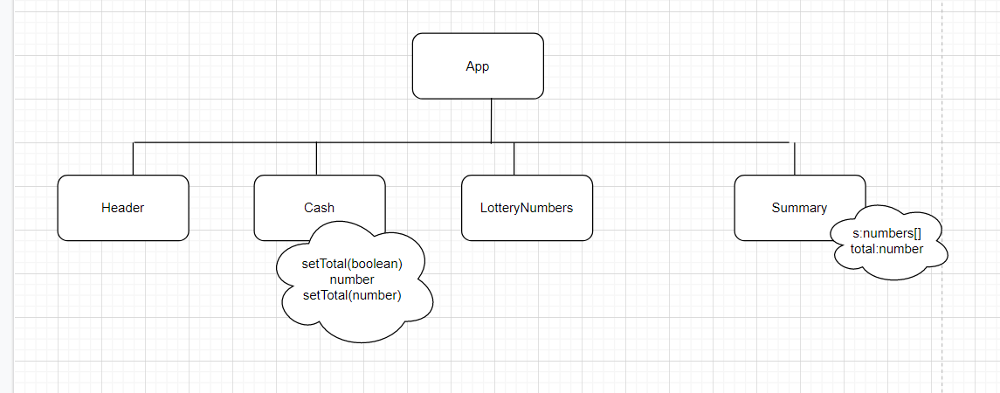
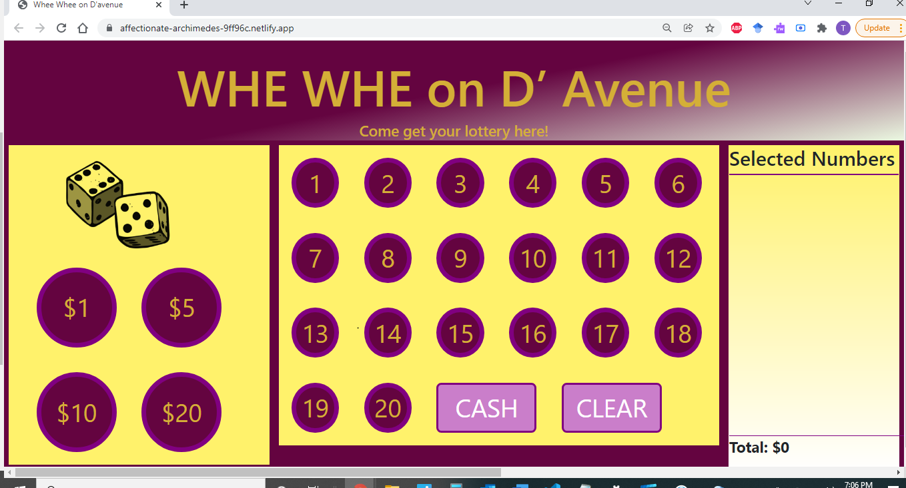

<h1>Whee Whee On D'avenue: Project Built using angular CLI</h1>
<h2>How to run<h2>
<ol>
  <li>Download file</li>
  <li>Install npm</li>
  <li>Change directory</li>
  <li>ng server -- open</li>
</ol>

<h2>About Project</h2>
<b>Netlify Link: https://affectionate-archimedes-9ff96c.netlify.app/</b>

This is a cashier app for Whee WHee, you can select lottery numbers and select bet amounts for the customer. You can only select 5 bet numbers at a time, but clear the selections and total amounts at anypoint of time. You can also select and unselect a number.
<b>** APP IS NOT RESPONSIVE, use ZOOM and ZOOm out to get correct UI</b>

<h2>Component tree</h2>

<h3>Key Points</h3>
<ol>
  <li>App component is the parent</li>
  <li>App is split into 4 components</li>
  <li>Data is passed through input and output decorators</li>
  <li>Summary could be the child of two components, but is a child of none because that doesnt support seperating components.</li>
</ol>

<b>** APP IS NOT RESPONSIVE, use ZOOM and ZOOm out to get correct UI</b>
